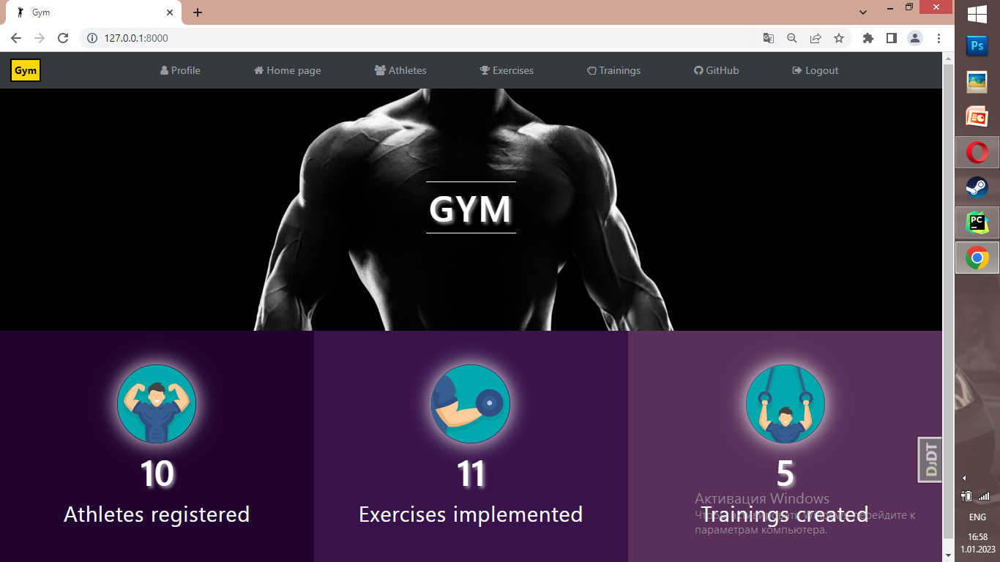
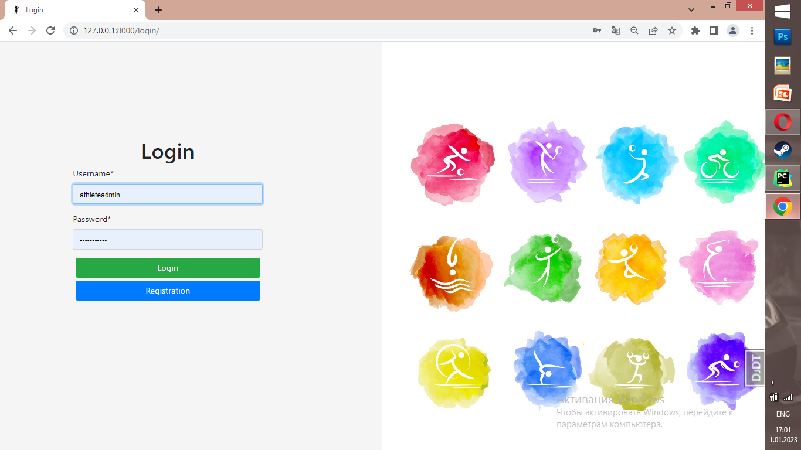
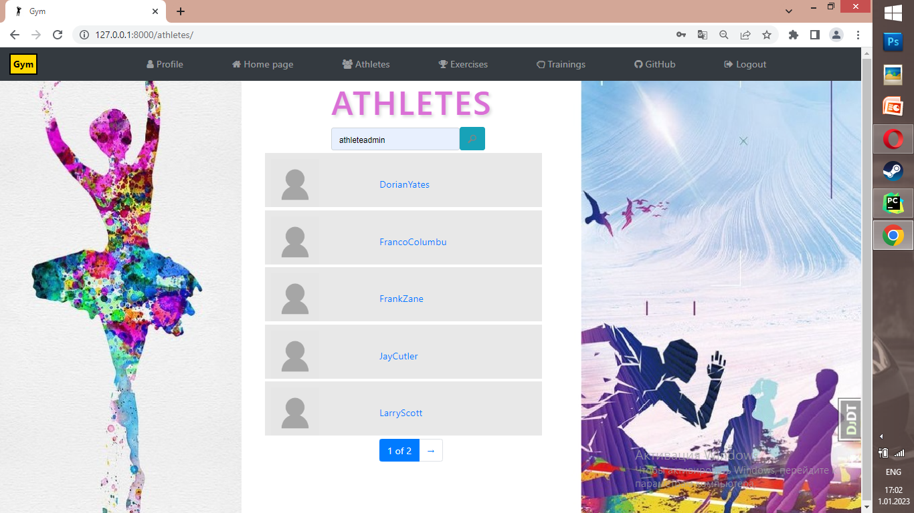
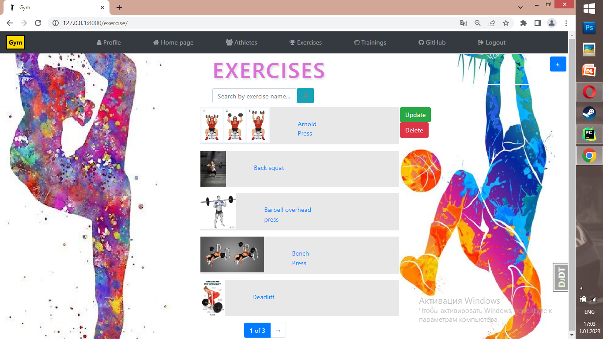
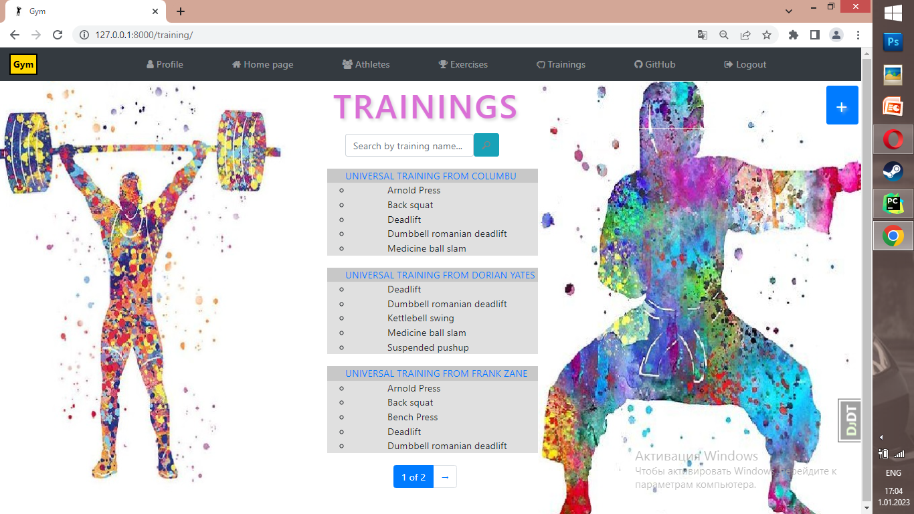
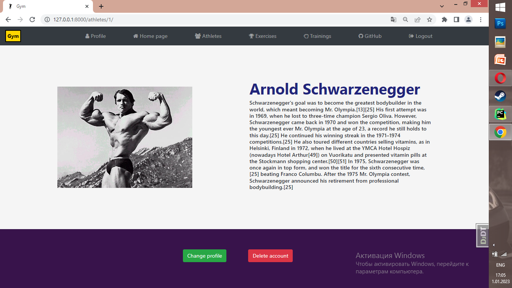
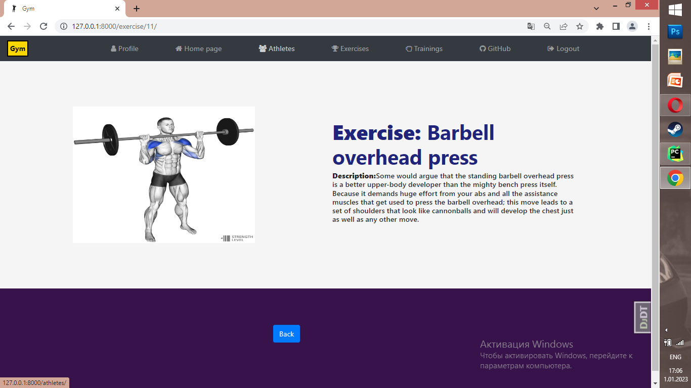
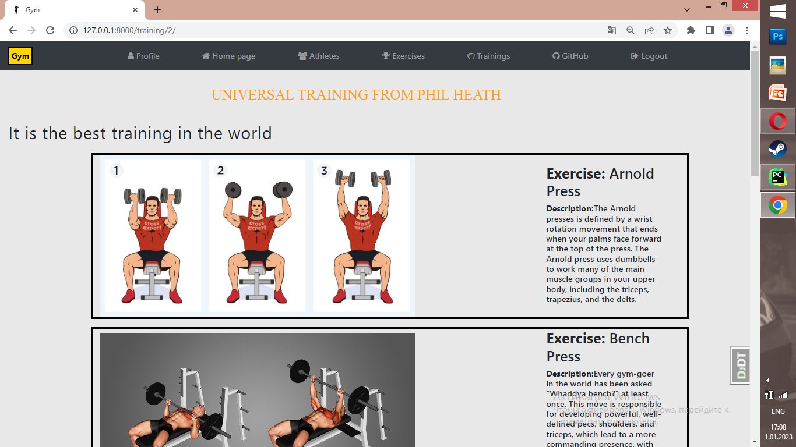
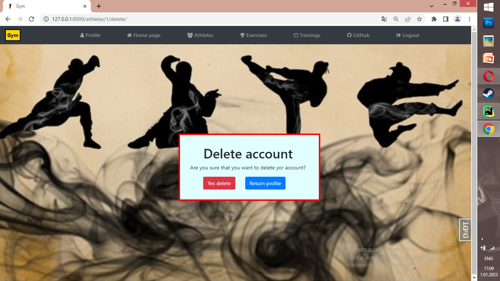

# Sports-training site


## Sports-training Project
Django project for athletes who want to share own experience with other people.
Here you can implement your own trainings and exercises for them.


## Check it out!
SportsTraining project deployed to Heroku

## Installation
Python3 must be already installed

```shell
git clone git@github.com:Polyakiv-Andrey/sports-training.git
cd SportsTraining
python3 -m venv venv
source venv/bin/activate
pip install -r requirements.txt
python manage.py runserver  # starts Django Server
```

## Features
Authentication functionality for Athlete/User
Registration functionality for Athlete/User
Managing athletes exercises & trainings directly from website interface
Powerful admin panel for advanced managing

## Demo









